# Comprehensive Entity Relationship Diagram (ERD)

## Matrimonial API Database Schema

### Academic Documentation

---

## 1. Entity Relationship Diagram (PlantUML)

```plantuml
@startuml MatrimonialAPI_Complete_ERD

!define table(x) class x << (T,#FFAAAA) >>
!define primary_key(x) <b>x</b>
!define foreign_key(x) <i>x</i>
!define unique_field(x) <u>x</u>
!define nullable_field(x) x*

' Core User Entity
table(users) {
    primary_key(id) : bigint
    name : varchar(255)
    unique_field(email) : varchar(255)
    nullable_field(email_verified_at) : timestamp
    password : varchar(255)
    nullable_field(age) : integer
    nullable_field(gender) : enum('male', 'female', 'other')
    nullable_field(religion) : varchar(255)
    nullable_field(caste) : varchar(255)
    nullable_field(income) : integer
    nullable_field(education) : varchar(255)
    nullable_field(location) : varchar(255)
    nullable_field(occupation) : varchar(255)
    nullable_field(bio) : text
    nullable_field(profile_picture) : varchar(255)
    nullable_field(remember_token) : varchar(100)
    created_at : timestamp
    updated_at : timestamp
}

' User Preferences Entity
table(preferences) {
    primary_key(id) : bigint
    foreign_key(user_id) : bigint
    nullable_field(preferred_age_min) : integer
    nullable_field(preferred_age_max) : integer
    nullable_field(preferred_gender) : enum('male', 'female', 'other')
    nullable_field(preferred_religion) : varchar(255)
    nullable_field(preferred_caste) : varchar(255)
    nullable_field(preferred_income_min) : integer
    nullable_field(preferred_income_max) : integer
    nullable_field(preferred_education) : varchar(255)
    nullable_field(preferred_location) : varchar(255)
    nullable_field(preferred_occupation) : varchar(255)
    age_weight : float (default: 1.0)
    gender_weight : float (default: 1.0)
    religion_weight : float (default: 1.0)
    caste_weight : float (default: 1.0)
    income_weight : float (default: 1.0)
    education_weight : float (default: 1.0)
    location_weight : float (default: 1.0)
    occupation_weight : float (default: 1.0)
    created_at : timestamp
    updated_at : timestamp
}

' Mutual Matches Entity
table(matches) {
    primary_key(id) : bigint
    foreign_key(user_id) : bigint
    foreign_key(matched_user_id) : bigint
    created_at : timestamp
    updated_at : timestamp
}

' User Likes/Interests Entity
table(likes) {
    primary_key(id) : bigint
    foreign_key(user_id) : bigint
    foreign_key(liked_user_id) : bigint
    created_at : timestamp
    updated_at : timestamp
}

' Messaging Entity
table(messages) {
    primary_key(id) : bigint
    foreign_key(from_user_id) : bigint
    foreign_key(to_user_id) : bigint
    message : text
    is_read : boolean (default: false)
    created_at : timestamp
    updated_at : timestamp
}

' Authentication & Security Entities
table(personal_access_tokens) {
    primary_key(id) : bigint
    tokenable_type : varchar(255)
    tokenable_id : bigint
    name : text
    unique_field(token) : varchar(64)
    nullable_field(abilities) : text
    nullable_field(last_used_at) : timestamp
    nullable_field(expires_at) : timestamp
    created_at : timestamp
    updated_at : timestamp
}

table(password_reset_tokens) {
    primary_key(email) : varchar(255)
    token : varchar(255)
    nullable_field(created_at) : timestamp
}

table(sessions) {
    primary_key(id) : varchar(255)
    nullable_field(user_id) : bigint
    nullable_field(ip_address) : varchar(45)
    nullable_field(user_agent) : text
    payload : longtext
    last_activity : integer
}

' Laravel System Tables
table(cache) {
    primary_key(key) : varchar(255)
    value : longtext
    expiration : integer
}

table(jobs) {
    primary_key(id) : bigint
    queue : varchar(255)
    payload : longtext
    attempts : tinyint
    nullable_field(reserved_at) : integer
    nullable_field(available_at) : integer
    created_at : integer
}

' Relationships
users ||--o{ preferences : "has preferences"
users ||--o{ matches : "user_matches"
users ||--o{ matches : "matched_by"
users ||--o{ likes : "likes"
users ||--o{ likes : "liked_by"
users ||--o{ messages : "sends"
users ||--o{ messages : "receives"
users ||--o{ personal_access_tokens : "has tokens"
users ||--o{ sessions : "has sessions"

' Constraints and Notes
note right of matches
  Unique constraint on (user_id, matched_user_id)
  Prevents duplicate matches
end note

note right of likes
  Unique constraint on (user_id, liked_user_id)
  Prevents duplicate likes
end note

note right of messages
  Indexes on (from_user_id, to_user_id)
  and (to_user_id, from_user_id)
  for efficient conversation queries
end note

note right of personal_access_tokens
  Polymorphic relationship
  tokenable_type and tokenable_id
  for flexible token ownership
end note

@enduml
```

---

## 2. Database Schema Analysis

### 2.1 Core Business Entities

#### **Users Table** - Primary Entity

-   **Purpose**: Stores comprehensive user profiles for matrimonial matching
-   **Key Features**:
    -   Complete demographic information (age, gender, religion, caste)
    -   Professional details (income, education, occupation, location)
    -   Personal information (bio, profile picture)
    -   Authentication data (email, password, verification status)

#### **Preferences Table** - User Matching Criteria

-   **Purpose**: Defines user preferences for potential matches
-   **Key Features**:
    -   Range-based preferences (age_min/max, income_min/max)
    -   Specific value preferences (gender, religion, caste, etc.)
    -   Weight-based scoring system for algorithmic matching
    -   One-to-one relationship with users

#### **Matches Table** - Mutual Connections

-   **Purpose**: Records successful mutual matches between users
-   **Key Features**:
    -   Self-referential many-to-many relationship
    -   Unique constraint prevents duplicate matches
    -   Cascade delete ensures data integrity

#### **Likes Table** - User Interests

-   **Purpose**: Tracks one-way user interests/likes
-   **Key Features**:
    -   Self-referential many-to-many relationship
    -   Unique constraint prevents duplicate likes
    -   Foundation for mutual matching algorithm

#### **Messages Table** - Communication System

-   **Purpose**: Enables communication between matched users
-   **Key Features**:
    -   Bidirectional messaging system
    -   Read status tracking
    -   Optimized indexes for conversation queries

### 2.2 Authentication & Security Entities

#### **Personal Access Tokens Table**

-   **Purpose**: Manages API authentication tokens
-   **Key Features**:
    -   Polymorphic relationship for flexible token ownership
    -   Token expiration and usage tracking
    -   Abilities/permissions system

#### **Password Reset Tokens Table**

-   **Purpose**: Handles password reset functionality
-   **Key Features**:
    -   Email-based token system
    -   Temporary token storage

#### **Sessions Table**

-   **Purpose**: Manages user sessions
-   **Key Features**:
    -   Session persistence across requests
    -   IP address and user agent tracking

### 2.3 System Tables

#### **Cache Table**

-   **Purpose**: Application-level caching
-   **Key Features**:
    -   Key-value storage for performance optimization

#### **Jobs Table**

-   **Purpose**: Background job processing
-   **Key Features**:
    -   Queue-based job management
    -   Retry mechanism with attempt tracking

---

## 3. Relationship Analysis

### 3.1 Primary Relationships

1. **User ↔ Preferences (1:1)**

    - Each user has exactly one preference set
    - Preferences are deleted when user is deleted (cascade)

2. **User ↔ User (Many:Many through Matches)**

    - Self-referential relationship
    - Represents mutual matches between users
    - Bidirectional relationship (if A matches B, B matches A)

3. **User ↔ User (Many:Many through Likes)**

    - Self-referential relationship
    - Represents one-way interests
    - Asymmetric relationship (A can like B without B liking A)

4. **User ↔ User (Many:Many through Messages)**
    - Self-referential relationship
    - Bidirectional communication
    - Messages flow between matched users

### 3.2 Authentication Relationships

1. **User ↔ Personal Access Tokens (1:Many)**

    - Users can have multiple API tokens
    - Polymorphic relationship allows flexibility

2. **User ↔ Sessions (1:Many)**
    - Users can have multiple active sessions
    - Sessions track user activity

---

## 4. Data Integrity Constraints

### 4.1 Primary Keys

-   All tables use auto-incrementing `id` as primary key
-   `password_reset_tokens` uses `email` as primary key
-   `sessions` uses `id` (string) as primary key

### 4.2 Foreign Key Constraints

-   All foreign keys have cascade delete for data integrity
-   `user_id` references `users.id`
-   `matched_user_id` and `liked_user_id` reference `users.id`
-   `from_user_id` and `to_user_id` reference `users.id`

### 4.3 Unique Constraints

-   `users.email` - Ensures unique email addresses
-   `matches(user_id, matched_user_id)` - Prevents duplicate matches
-   `likes(user_id, liked_user_id)` - Prevents duplicate likes
-   `personal_access_tokens.token` - Ensures unique API tokens

### 4.4 Indexes

-   Messages table has composite indexes for efficient conversation queries
-   Sessions table has indexes on `user_id` and `last_activity`
-   Jobs table has indexes on `queue` and `reserved_at`

---

## 5. Business Logic Implementation

### 5.1 Matching Algorithm Foundation

The database schema supports sophisticated matching algorithms through:

-   **Preference-based filtering**: Age, gender, religion, caste, income ranges
-   **Weighted scoring**: Individual weights for each preference category
-   **Mutual interest tracking**: Likes table enables mutual matching detection
-   **Profile completeness**: Comprehensive user data for accurate matching

### 5.2 Communication Flow

1. Users create profiles and set preferences
2. System suggests matches based on preferences
3. Users can like potential matches
4. Mutual likes create matches
5. Matched users can communicate via messages

### 5.3 Security Implementation

-   **Token-based authentication**: Personal access tokens for API access
-   **Session management**: Secure session tracking
-   **Password security**: Reset token system
-   **Data privacy**: Cascade deletes ensure user data removal

---

## 6. Academic Significance

### 6.1 Database Design Patterns

-   **Self-referential relationships**: Efficient user-to-user connections
-   **Polymorphic relationships**: Flexible token management
-   **Composite unique constraints**: Data integrity enforcement
-   **Cascade operations**: Referential integrity maintenance

### 6.2 Scalability Considerations

-   **Indexed queries**: Optimized for high-traffic scenarios
-   **Queue-based processing**: Background job handling
-   **Caching support**: Performance optimization
-   **Modular design**: Easy to extend and maintain

### 6.3 Real-world Application

This schema demonstrates:

-   **Social networking principles**: User connections and communication
-   **E-commerce concepts**: User preferences and matching
-   **Security best practices**: Authentication and authorization
-   **API design patterns**: RESTful service architecture

---

_This ER diagram represents the complete and accurate database structure of the Matrimonial API project, suitable for academic documentation and analysis._
