# 🔄 Consolidated Sequence Diagram - Matrimonial API System

## 🎯 **System Overview**

This consolidated sequence diagram shows the essential flows of the Matrimonial API system in a compact format suitable for documentation.

## 🔄 **Simplified System Sequence Diagram**

```mermaid
sequenceDiagram
    participant MA as Mobile App
    participant API as API Server
    participant DB as Database
    participant FCM as Firebase FCM

    Note over MA,FCM: 🚀 MATRIMONIAL API SYSTEM FLOW

    %% User Registration & Login
    rect rgb(240, 248, 255)
        Note over MA,DB: 📝 AUTHENTICATION
        MA->>API: POST /api/register (user data)
        API->>DB: Create user & preferences
        API-->>MA: JWT token + user data
        
        MA->>API: POST /api/login (credentials)
        API->>DB: Validate user
        API-->>MA: JWT token + user data
    end

    %% Profile & FCM Setup
    rect rgb(255, 248, 240)
        Note over MA,DB: 👤 PROFILE & NOTIFICATIONS
        MA->>API: POST /api/profile (profile data)
        API->>DB: Update profile & preferences
        API-->>MA: Updated profile
        
        MA->>API: POST /api/notifications/fcm-token
        API->>DB: Store FCM token
        API-->>MA: Token registered
    end

    %% Discovery & Matching
    rect rgb(248, 255, 248)
        Note over MA,DB: 🔍 DISCOVERY & MATCHING
        MA->>API: GET /api/discover
        API->>DB: Get eligible profiles
        API-->>MA: Discover profiles
        
        MA->>API: POST /api/discover/like (user_id)
        API->>DB: Create like & check match
        alt Mutual like
            API->>DB: Create match
            API->>FCM: Send match notification
            API-->>MA: "It's a match!"
        else No match
            API->>FCM: Send like notification
            API-->>MA: "Profile liked"
        end
    end

    %% Communication
    rect rgb(255, 248, 255)
        Note over MA,DB: 💬 MESSAGING
        MA->>API: GET /api/matches
        API->>DB: Get mutual matches
        API-->>MA: Matches list
        
        MA->>API: POST /api/messages (message)
        API->>DB: Verify match & store message
        API->>FCM: Send message notification
        API-->>MA: Message sent
        
        MA->>API: GET /api/messages (conversation)
        API->>DB: Get chat history
        API-->>MA: Messages list
    end

    %% Notifications & Updates
    rect rgb(248, 255, 255)
        Note over MA,DB: 🔔 NOTIFICATIONS & UPDATES
        MA->>API: GET /api/notifications
        API->>DB: Get user notifications
        API-->>MA: Notifications list
        
        MA->>API: PUT /api/profile (updates)
        API->>DB: Update profile
        API-->>MA: Profile updated
        
        MA->>API: POST /api/logout
        API->>DB: Invalidate token
        API-->>MA: Logged out
    end

    %% Error Handling
    rect rgb(255, 240, 240)
        Note over MA,DB: ❌ ERROR HANDLING
        alt Invalid token
            API-->>MA: 401 Unauthorized
        else Validation error
            API-->>MA: 422 Validation Error
        else Server error
            API-->>MA: 500 Internal Server Error
        end
    end
```

## 📊 **System Components**

### **🎯 Actors**
- **Mobile App**: React Native/Expo frontend
- **API Server**: Laravel backend API
- **Database**: MySQL database
- **Firebase FCM**: Push notification service

## 🔄 **Key System Flows**

### **1. Authentication Flow**
- User registration with validation
- Login with JWT token generation
- Profile setup and FCM token registration

### **2. Discovery & Matching Flow**
- Get eligible profiles for discovery
- Like profiles with mutual match detection
- Create matches when both users like each other
- Send push notifications for matches and likes

### **3. Communication Flow**
- View mutual matches only
- Send messages between matched users
- Retrieve conversation history
- Real-time push notifications for messages

### **4. Management Flow**
- View and manage notifications
- Update profile and preferences
- Secure logout with token invalidation

## 🔒 **Security Features**

- **JWT Authentication**: Token validation on every request
- **Authorization**: Users can only access their own data
- **Match Verification**: Messages only between matched users
- **Input Validation**: Data sanitization and validation

## 📈 **Performance Features**

- **Pagination**: Efficient data loading
- **Indexing**: Optimized database queries
- **Caching**: User profile and match caching
- **Push Notifications**: Real-time updates via FCM

## 🔄 **Error Handling**

- **401**: Unauthorized (invalid token)
- **422**: Validation errors
- **500**: Server errors
- **Rate Limiting**: Prevent abuse

## 📊 **Data Flow Summary**

1. **User Input** → Mobile App validation
2. **API Processing** → Business logic & validation
3. **Database Operations** → CRUD with transactions
4. **External Services** → FCM for notifications
5. **Response** → Formatted data to Mobile App

This simplified sequence diagram provides a clear overview of the Matrimonial API system while being compact enough for documentation purposes.
