# 🔄 Consolidated Sequence Diagram - Matrimonial API System

## 🎯 **System Overview**

This consolidated sequence diagram shows the complete flow of the Matrimonial API system, including all major interactions between the Mobile App, API Server, Database, and Firebase FCM service.

## 🔄 **Complete System Sequence Diagram**

```mermaid
sequenceDiagram
    participant MA as Mobile App
    participant API as API Server
    participant DB as Database
    participant FCM as Firebase FCM
    participant Auth as Auth Service
    participant Match as Matchmaking Service
    participant Notif as Notification Service

    Note over MA,Notif: 🚀 COMPLETE MATRIMONIAL API SYSTEM FLOW

    %% User Registration Flow
    rect rgb(240, 248, 255)
        Note over MA,DB: 📝 USER REGISTRATION & AUTHENTICATION
        MA->>API: POST /api/register (name, email, password, gender, etc.)
        API->>Auth: Validate registration data
        Auth->>DB: Check if email exists
        DB-->>Auth: Email status
        alt Email not exists
            Auth->>DB: Create new user record
            DB-->>Auth: User created with ID
            Auth->>API: Generate JWT token
            API-->>MA: 201 Created + JWT token + user data
        else Email exists
            API-->>MA: 422 Validation Error
        end
    end

    %% User Login Flow
    rect rgb(255, 248, 240)
        Note over MA,DB: 🔐 USER LOGIN
        MA->>API: POST /api/login (email, password)
        API->>Auth: Validate credentials
        Auth->>DB: Get user by email
        DB-->>Auth: User data
        Auth->>Auth: Verify password hash
        alt Valid credentials
            Auth->>API: Generate JWT token
            API->>DB: Update last_login_at
            API-->>MA: 200 OK + JWT token + user data
        else Invalid credentials
            API-->>MA: 401 Unauthorized
        end
    end

    %% Profile Setup Flow
    rect rgb(248, 255, 248)
        Note over MA,DB: 👤 PROFILE SETUP & PREFERENCES
        MA->>API: POST /api/profile (Authorization: Bearer token)
        API->>Auth: Validate JWT token
        Auth->>DB: Get user by token
        DB-->>Auth: User data
        API->>DB: Update user profile
        API->>DB: Create/Update preferences
        DB-->>API: Profile updated
        API-->>MA: 200 OK + updated profile
    end

    %% FCM Token Registration
    rect rgb(255, 240, 245)
        Note over MA,DB: 🔔 FCM TOKEN REGISTRATION
        MA->>API: POST /api/notifications/fcm-token (fcm_token)
        API->>Auth: Validate JWT token
        Auth->>DB: Get user by token
        API->>DB: Update user fcm_token
        DB-->>API: Token updated
        API-->>MA: 200 OK + confirmation
    end

    %% Discover Profiles Flow
    rect rgb(245, 245, 245)
        Note over MA,DB: 🔍 DISCOVER PROFILES
        MA->>API: GET /api/discover?page=1&limit=10 (Authorization: Bearer token)
        API->>Auth: Validate JWT token
        Auth->>DB: Get user by token
        DB-->>Auth: User data
        API->>Match: Get discover recommendations
        Match->>DB: Get user preferences
        DB-->>Match: Preferences data
        Match->>DB: Get eligible profiles (exclude liked, liked-by, matched)
        DB-->>Match: Eligible profiles
        Match->>Match: Calculate compatibility scores
        Match->>API: Ranked profiles with scores
        API-->>MA: 200 OK + discover profiles
    end

    %% Like Profile Flow
    rect rgb(255, 255, 240)
        Note over MA,DB: ❤️ LIKE PROFILE
        MA->>API: POST /api/discover/like (target_user_id)
        API->>Auth: Validate JWT token
        Auth->>DB: Get current user
        DB-->>Auth: Current user data
        API->>DB: Create like record
        DB-->>API: Like created
        API->>DB: Check if mutual like exists
        DB-->>API: Check result
        alt Mutual like exists
            API->>DB: Create match record (both directions)
            DB-->>API: Match created
            API->>Notif: Send match notification
            Notif->>FCM: Send push notification
            FCM-->>Notif: Delivery confirmation
            Notif->>DB: Store notification record
            API-->>MA: 201 Created + "It's a match!"
        else No mutual like
            API->>Notif: Send like notification
            Notif->>FCM: Send push notification
            FCM-->>Notif: Delivery confirmation
            Notif->>DB: Store notification record
            API-->>MA: 201 Created + "Profile liked"
        end
    end

    %% Unlike Profile Flow
    rect rgb(255, 240, 240)
        Note over MA,DB: 💔 UNLIKE PROFILE
        MA->>API: DELETE /api/discover/unlike (target_user_id)
        API->>Auth: Validate JWT token
        Auth->>DB: Get current user
        API->>DB: Remove like record
        DB-->>API: Like removed
        API->>DB: Check if match exists
        DB-->>API: Match status
        alt Match exists
            API->>DB: Remove match record (both directions)
            DB-->>API: Match removed
            API-->>MA: 200 OK + "Match removed"
        else No match
            API-->>MA: 200 OK + "Like removed"
        end
    end

    %% Get Matches Flow
    rect rgb(240, 255, 255)
        Note over MA,DB: 💕 GET MATCHES
        MA->>API: GET /api/matches?page=1&limit=10
        API->>Auth: Validate JWT token
        Auth->>DB: Get current user
        DB-->>Auth: Current user data
        API->>DB: Get mutual matches (intersection of likes)
        DB-->>API: Mutual matches
        API-->>MA: 200 OK + matches list
    end

    %% Send Message Flow
    rect rgb(248, 248, 255)
        Note over MA,DB: 💬 SEND MESSAGE
        MA->>API: POST /api/messages (to_user_id, message)
        API->>Auth: Validate JWT token
        Auth->>DB: Get current user
        DB-->>Auth: Current user data
        API->>DB: Verify users are matched
        DB-->>API: Match status
        alt Users are matched
            API->>DB: Create message record
            DB-->>API: Message created
            API->>Notif: Send message notification
            Notif->>FCM: Send push notification
            FCM-->>Notif: Delivery confirmation
            Notif->>DB: Store notification record
            API-->>MA: 201 Created + message data
        else Users not matched
            API-->>MA: 403 Forbidden + "Users must be matched"
        end
    end

    %% Get Messages Flow
    rect rgb(255, 248, 255)
        Note over MA,DB: 📨 GET MESSAGES
        MA->>API: GET /api/messages?with_user_id=X&page=1
        API->>Auth: Validate JWT token
        Auth->>DB: Get current user
        DB-->>Auth: Current user data
        API->>DB: Get messages between users
        DB-->>API: Messages list
        API->>DB: Mark messages as read
        DB-->>API: Read status updated
        API-->>MA: 200 OK + messages list
    end

    %% Get Notifications Flow
    rect rgb(248, 255, 248)
        Note over MA,DB: 🔔 GET NOTIFICATIONS
        MA->>API: GET /api/notifications?page=1&limit=20
        API->>Auth: Validate JWT token
        Auth->>DB: Get current user
        DB-->>Auth: Current user data
        API->>DB: Get user notifications
        DB-->>API: Notifications list
        API-->>MA: 200 OK + notifications list
    end

    %% Mark Notification as Read
    rect rgb(255, 255, 248)
        Note over MA,DB: ✅ MARK NOTIFICATION READ
        MA->>API: PUT /api/notifications/{id}/read
        API->>Auth: Validate JWT token
        Auth->>DB: Get current user
        API->>DB: Mark notification as read
        DB-->>API: Notification updated
        API-->>MA: 200 OK + confirmation
    end

    %% Update Profile Flow
    rect rgb(240, 248, 255)
        Note over MA,DB: ✏️ UPDATE PROFILE
        MA->>API: PUT /api/profile (updated data)
        API->>Auth: Validate JWT token
        Auth->>DB: Get current user
        API->>DB: Update user profile
        DB-->>API: Profile updated
        API-->>MA: 200 OK + updated profile
    end

    %% Update Preferences Flow
    rect rgb(255, 248, 240)
        Note over MA,DB: ⚙️ UPDATE PREFERENCES
        MA->>API: PUT /api/preferences (new preferences)
        API->>Auth: Validate JWT token
        Auth->>DB: Get current user
        API->>DB: Update user preferences
        DB-->>API: Preferences updated
        API-->>MA: 200 OK + updated preferences
    end

    %% Get Recommendations Flow
    rect rgb(248, 255, 248)
        Note over MA,DB: 🎯 GET RECOMMENDATIONS
        MA->>API: GET /api/recommendations?page=1&limit=10
        API->>Auth: Validate JWT token
        Auth->>DB: Get current user
        DB-->>Auth: Current user data
        API->>Match: Get personalized recommendations
        Match->>DB: Get user preferences
        DB-->>Match: Preferences data
        Match->>DB: Get potential matches
        DB-->>Match: Potential matches
        Match->>Match: Apply collaborative filtering
        Match->>Match: Calculate weighted scores
        Match->>API: Ranked recommendations
        API-->>MA: 200 OK + recommendations list
    end

    %% Logout Flow
    rect rgb(255, 240, 240)
        Note over MA,DB: 🚪 LOGOUT
        MA->>API: POST /api/logout
        API->>Auth: Invalidate JWT token
        Auth->>DB: Update token status
        DB-->>Auth: Token invalidated
        API-->>MA: 200 OK + "Logged out successfully"
    end

    %% Error Handling
    rect rgb(255, 240, 240)
        Note over MA,DB: ❌ ERROR HANDLING
        alt Invalid token
            API-->>MA: 401 Unauthorized
        else Validation error
            API-->>MA: 422 Validation Error + details
        else Server error
            API-->>MA: 500 Internal Server Error
        else Rate limit exceeded
            API-->>MA: 429 Too Many Requests
        end
    end
```

## 📊 **System Components**

### **🎯 Actors**
- **Mobile App**: React Native/Expo frontend application
- **API Server**: Laravel backend API
- **Database**: MySQL database
- **Firebase FCM**: Push notification service

### **🔧 Services**
- **Auth Service**: Authentication and authorization
- **Matchmaking Service**: Profile matching and recommendations
- **Notification Service**: Push notification management

## 🔄 **Key System Flows**

### **1. User Lifecycle**
1. **Registration** → Account creation with validation
2. **Login** → Authentication with JWT tokens
3. **Profile Setup** → Complete profile and preferences
4. **FCM Registration** → Enable push notifications

### **2. Discovery & Matching**
1. **Discover Profiles** → Get eligible profiles with scores
2. **Like/Unlike** → One-way likes with mutual match detection
3. **Get Matches** → View mutual matches only
4. **Get Recommendations** → AI-powered suggestions

### **3. Communication**
1. **Send Message** → Chat between matched users
2. **Get Messages** → Retrieve conversation history
3. **Read Status** → Track message read status

### **4. Notifications**
1. **Push Notifications** → Real-time alerts via FCM
2. **Notification History** → View and manage notifications
3. **Read Status** → Mark notifications as read

## 🔒 **Security Features**

### **Authentication**
- JWT token validation on every request
- Token expiration and refresh
- Secure password hashing

### **Authorization**
- User can only access their own data
- Match verification for messaging
- Rate limiting to prevent abuse

### **Data Protection**
- Input validation and sanitization
- SQL injection prevention
- XSS protection

## 📈 **Performance Optimizations**

### **Database**
- Strategic indexing on frequently queried fields
- Query optimization for complex operations
- Connection pooling

### **Caching**
- User profile caching
- Match list caching
- Notification caching

### **API**
- Response compression
- Pagination for large datasets
- Efficient data serialization

## 🔄 **Error Handling**

### **Client Errors (4xx)**
- **400**: Bad Request - Invalid input
- **401**: Unauthorized - Invalid/missing token
- **403**: Forbidden - Insufficient permissions
- **404**: Not Found - Resource doesn't exist
- **422**: Validation Error - Invalid data format
- **429**: Too Many Requests - Rate limit exceeded

### **Server Errors (5xx)**
- **500**: Internal Server Error - Unexpected server error
- **502**: Bad Gateway - External service error
- **503**: Service Unavailable - Maintenance mode

## 📱 **Mobile App Integration**

### **State Management**
- JWT token storage in secure storage
- User profile caching
- Offline message queuing
- Push notification handling

### **Real-time Features**
- Push notification reception
- Message delivery status
- Online/offline status
- Typing indicators

## 🔔 **Notification Types**

### **System Notifications**
- **Match**: "You have a new match!"
- **Like**: "Someone liked your profile"
- **Message**: "New message from [Name]"
- **Profile View**: "Someone viewed your profile"

### **Delivery Methods**
- **Push Notifications**: Real-time via FCM
- **In-App Notifications**: Stored in database
- **Email Notifications**: For important events

## 📊 **Data Flow Summary**

1. **User Input** → Mobile App validates and sends to API
2. **API Processing** → Business logic and data validation
3. **Database Operations** → CRUD operations with transactions
4. **External Services** → FCM for push notifications
5. **Response** → Formatted data sent back to Mobile App

This consolidated sequence diagram provides a complete view of the Matrimonial API system, showing all major interactions and data flows between components. It serves as a comprehensive reference for understanding the system architecture and user journey.
