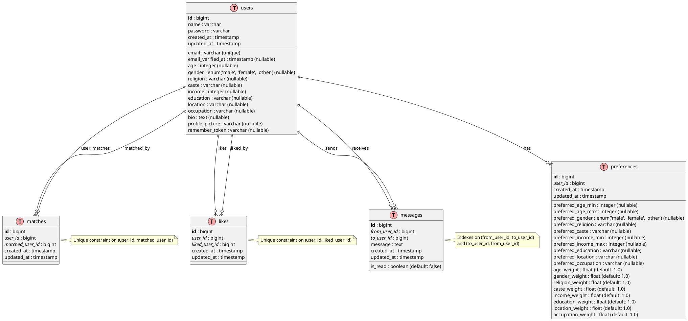

# Matrimonial API Database Schema

## Entity Relationship Diagram

## Database Schema Description

### Core Tables

#### 1. **users** - Main user profiles

-   **Primary Key**: `id` (auto-incrementing bigint)
-   **Unique Fields**: `email`
-   **Profile Information**: name, age, gender, religion, caste, income, education, location, occupation, bio, profile_picture
-   **Authentication**: email, password, email_verified_at, remember_token
-   **Timestamps**: created_at, updated_at

#### 2. **preferences** - User matching preferences

-   **Primary Key**: `id` (auto-incrementing bigint)
-   **Foreign Key**: `user_id` → users.id (cascade delete)
-   **Preference Ranges**: age_min/max, income_min/max
-   **Preference Values**: gender, religion, caste, education, location, occupation
-   **Weight System**: Individual weights for each preference category (default: 1.0)
-   **Timestamps**: created_at, updated_at

#### 3. **matches** - Mutual matches between users

-   **Primary Key**: `id` (auto-incrementing bigint)
-   **Foreign Keys**:
    -   `user_id` → users.id (cascade delete)
    -   `matched_user_id` → users.id (cascade delete)
-   **Unique Constraint**: (user_id, matched_user_id) prevents duplicate matches
-   **Timestamps**: created_at, updated_at

#### 4. **likes** - User likes/interests

-   **Primary Key**: `id` (auto-incrementing bigint)
-   **Foreign Keys**:
    -   `user_id` → users.id (cascade delete)
    -   `liked_user_id` → users.id (cascade delete)
-   **Unique Constraint**: (user_id, liked_user_id) prevents duplicate likes
-   **Timestamps**: created_at, updated_at

#### 5. **messages** - Communication between matched users

-   **Primary Key**: `id` (auto-incrementing bigint)
-   **Foreign Keys**:
    -   `from_user_id` → users.id (cascade delete)
    -   `to_user_id` → users.id (cascade delete)
-   **Message Data**: message (text), is_read (boolean)
-   **Indexes**: Optimized for conversation queries
-   **Timestamps**: created_at, updated_at

### Key Features

1. **Cascade Deletes**: When a user is deleted, all related records (preferences, matches, likes, messages) are automatically removed
2. **Unique Constraints**: Prevents duplicate matches and likes
3. **Indexed Queries**: Messages table has indexes for efficient conversation retrieval
4. **Flexible Preferences**: Weight-based preference system allows for customizable matching algorithms
5. **Comprehensive User Profiles**: Rich profile data including cultural and professional information

### Relationships

-   **One-to-One**: User ↔ Preferences (each user has one preference set)
-   **Many-to-Many**: Users ↔ Users (through matches, likes, and messages)
-   **Self-Referential**: Users can match with, like, and message other users

This schema supports a complete matrimonial matching system with profile management, preference-based matching, mutual connections, and messaging capabilities.
