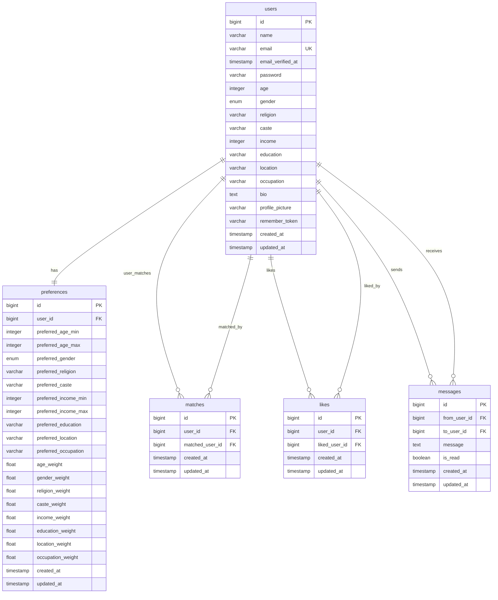

# Matrimonial API Database Schema (Mermaid)

## Entity Relationship Diagram

## Database Schema Summary

### Table Structure

| Table           | Purpose                          | Key Relationships                              |
| --------------- | -------------------------------- | ---------------------------------------------- |
| **users**       | User profiles and authentication | Primary entity, referenced by all other tables |
| **preferences** | User matching preferences        | One-to-one with users                          |
| **matches**     | Mutual matches between users     | Many-to-many self-referential through users    |
| **likes**       | User likes/interests             | Many-to-many self-referential through users    |
| **messages**    | Communication between users      | Many-to-many self-referential through users    |

### Key Features

1. **Comprehensive User Profiles**: Rich data including cultural, professional, and personal information
2. **Flexible Matching System**: Weight-based preferences for customizable algorithms
3. **Mutual Connections**: Matches require mutual interest
4. **Communication System**: Messaging between matched users
5. **Data Integrity**: Foreign key constraints with cascade deletes
6. **Performance Optimization**: Indexed queries for efficient data retrieval

### Constraints and Indexes

-   **Unique Constraints**:

    -   `users.email` - No duplicate emails
    -   `matches(user_id, matched_user_id)` - No duplicate matches
    -   `likes(user_id, liked_user_id)` - No duplicate likes

-   **Indexes**:

    -   `messages(from_user_id, to_user_id)` - Fast conversation queries
    -   `messages(to_user_id, from_user_id)` - Fast conversation queries

-   **Foreign Key Constraints**:
    -   All foreign keys have cascade delete for data consistency

This schema provides a solid foundation for a matrimonial matching platform with all essential features for user management, matching, and communication.
