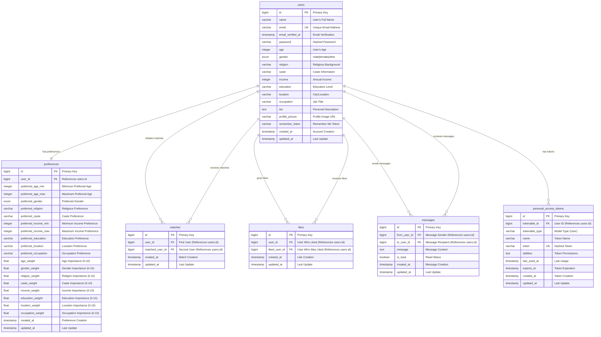
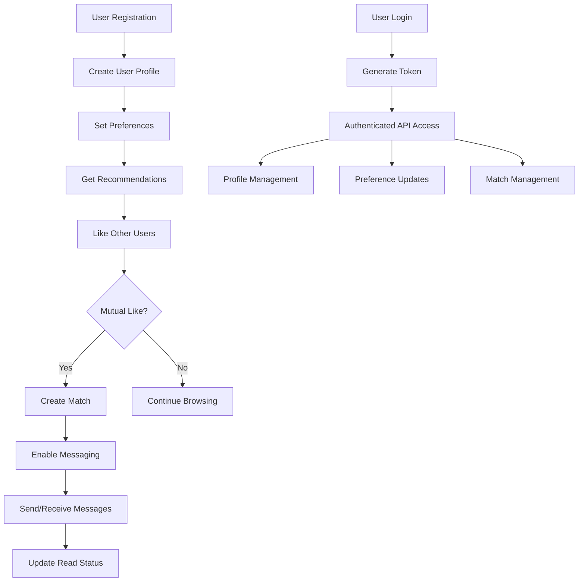

# Matrimonial API - Entity Relationship Diagram

## 📊 Complete ER Diagram



## 🔗 Relationship Details

### Primary Relationships

| Relationship                       | Type | Description                              | Business Logic                   |
| ---------------------------------- | ---- | ---------------------------------------- | -------------------------------- |
| **users ↔ preferences**            | 1:1  | Each user has exactly one preference set | User preferences for matchmaking |
| **users ↔ matches**                | M:M  | Users can have multiple matches          | Mutual matching system           |
| **users ↔ likes**                  | M:M  | Users can like multiple others           | Interest expression system       |
| **users ↔ messages**               | M:M  | Users can send/receive messages          | Communication system             |
| **users ↔ personal_access_tokens** | 1:M  | Users can have multiple API tokens       | Authentication system            |

### Self-Referential Relationships

| Table        | Relationship                  | Purpose                      |
| ------------ | ----------------------------- | ---------------------------- |
| **matches**  | `user_id` ↔ `matched_user_id` | Mutual matches between users |
| **likes**    | `user_id` ↔ `liked_user_id`   | User likes/interests         |
| **messages** | `from_user_id` ↔ `to_user_id` | Message communication        |

## 📋 Database Constraints

### Primary Keys

-   All tables have auto-incrementing `id` as primary key
-   Ensures unique identification of each record

### Foreign Keys

-   All foreign keys reference `users.id`
-   Cascade delete ensures data consistency
-   Prevents orphaned records

### Unique Constraints

```sql
-- Email uniqueness
ALTER TABLE users ADD UNIQUE (email);

-- Match uniqueness (prevents duplicate matches)
ALTER TABLE matches ADD UNIQUE (user_id, matched_user_id);

-- Like uniqueness (prevents duplicate likes)
ALTER TABLE likes ADD UNIQUE (user_id, liked_user_id);

-- Token uniqueness
ALTER TABLE personal_access_tokens ADD UNIQUE (token);
```

### Indexes for Performance

```sql
-- User queries
CREATE INDEX idx_users_email ON users(email);
CREATE INDEX idx_users_age ON users(age);
CREATE INDEX idx_users_gender ON users(gender);
CREATE INDEX idx_users_religion ON users(religion);
CREATE INDEX idx_users_location ON users(location);

-- Preference queries
CREATE INDEX idx_preferences_user_id ON preferences(user_id);
CREATE INDEX idx_preferences_age_range ON preferences(preferred_age_min, preferred_age_max);

-- Match queries
CREATE INDEX idx_matches_user_id ON matches(user_id);
CREATE INDEX idx_matches_matched_user_id ON matches(matched_user_id);

-- Like queries
CREATE INDEX idx_likes_user_id ON likes(user_id);
CREATE INDEX idx_likes_liked_user_id ON likes(liked_user_id);

-- Message queries (optimized for conversations)
CREATE INDEX idx_messages_conversation ON messages(from_user_id, to_user_id);
CREATE INDEX idx_messages_conversation_reverse ON messages(to_user_id, from_user_id);
CREATE INDEX idx_messages_created_at ON messages(created_at);
```

## 🎯 Business Rules

### User Management

1. **Email Uniqueness**: Each user must have a unique email address
2. **Profile Completeness**: Users can have partial profiles (optional fields)
3. **Age Validation**: Age must be reasonable (18+ for matrimonial purposes)

### Matchmaking System

1. **Preference Requirements**: Users must set preferences for matchmaking
2. **Mutual Matching**: Matches are created only when both users like each other
3. **Weight System**: Each preference has configurable importance (0-10)

### Communication System

1. **Match-Only Messaging**: Messages can only be sent between matched users
2. **Read Status Tracking**: Messages track read/unread status
3. **Conversation History**: Complete message history is maintained

### Authentication System

1. **Token-Based Auth**: Laravel Sanctum for API authentication
2. **Multiple Tokens**: Users can have multiple active tokens
3. **Token Expiration**: Configurable token expiration

## 📊 Data Flow Diagram



## 🔍 Query Examples

### Common Database Queries

#### 1. Get User with Preferences

```sql
SELECT u.*, p.*
FROM users u
LEFT JOIN preferences p ON u.id = p.user_id
WHERE u.id = ?
```

#### 2. Get User Matches

```sql
SELECT m.*, u.*
FROM matches m
JOIN users u ON m.matched_user_id = u.id
WHERE m.user_id = ?
```

#### 3. Get User Likes

```sql
SELECT l.*, u.*
FROM likes l
JOIN users u ON l.liked_user_id = u.id
WHERE l.user_id = ?
```

#### 4. Get Conversation Messages

```sql
SELECT m.*,
       sender.name as sender_name,
       receiver.name as receiver_name
FROM messages m
JOIN users sender ON m.from_user_id = sender.id
JOIN users receiver ON m.to_user_id = receiver.id
WHERE (m.from_user_id = ? AND m.to_user_id = ?)
   OR (m.from_user_id = ? AND m.to_user_id = ?)
ORDER BY m.created_at ASC
```

#### 5. Get Matchmaking Recommendations

```sql
SELECT u.*,
       CASE
           WHEN u.gender = p.preferred_gender THEN 1.0
           ELSE 0.0
       END as gender_score,
       CASE
           WHEN u.religion = p.preferred_religion THEN 1.0
           ELSE 0.0
       END as religion_score
FROM users u
CROSS JOIN preferences p
WHERE p.user_id = ?
  AND u.id != p.user_id
  AND u.age BETWEEN p.preferred_age_min AND p.preferred_age_max
ORDER BY (gender_score * p.gender_weight + religion_score * p.religion_weight) DESC
```

## 🚀 Performance Considerations

### Database Optimization

1. **Indexed Queries**: All frequently accessed columns are indexed
2. **Composite Indexes**: Optimized for complex queries (conversations, matches)
3. **Eager Loading**: Prevents N+1 query problems in Laravel
4. **Pagination**: Efficient result pagination for large datasets

### Caching Strategy

1. **User Profiles**: Cache frequently accessed user data
2. **Recommendations**: Cache matchmaking results
3. **Conversations**: Cache recent message history
4. **Preferences**: Cache user preference data

### Scalability Features

1. **Horizontal Scaling**: Stateless API design
2. **Database Sharding**: Ready for horizontal database scaling
3. **Load Balancing**: API ready for load balancer deployment
4. **CDN Integration**: Static assets can be served via CDN

## 📈 Monitoring and Analytics

### Key Metrics to Track

1. **User Engagement**: Active users, profile completion rates
2. **Match Success**: Match creation rates, mutual like percentages
3. **Communication**: Message volume, response rates
4. **Performance**: Query response times, API latency
5. **System Health**: Error rates, uptime, resource usage

### Database Monitoring

1. **Query Performance**: Slow query identification
2. **Index Usage**: Index efficiency monitoring
3. **Connection Pooling**: Database connection management
4. **Storage Growth**: Database size monitoring

---

**This ER diagram provides a complete visual representation of the matrimonial API database structure, relationships, and business rules. It serves as a comprehensive reference for developers, database administrators, and system architects.**
