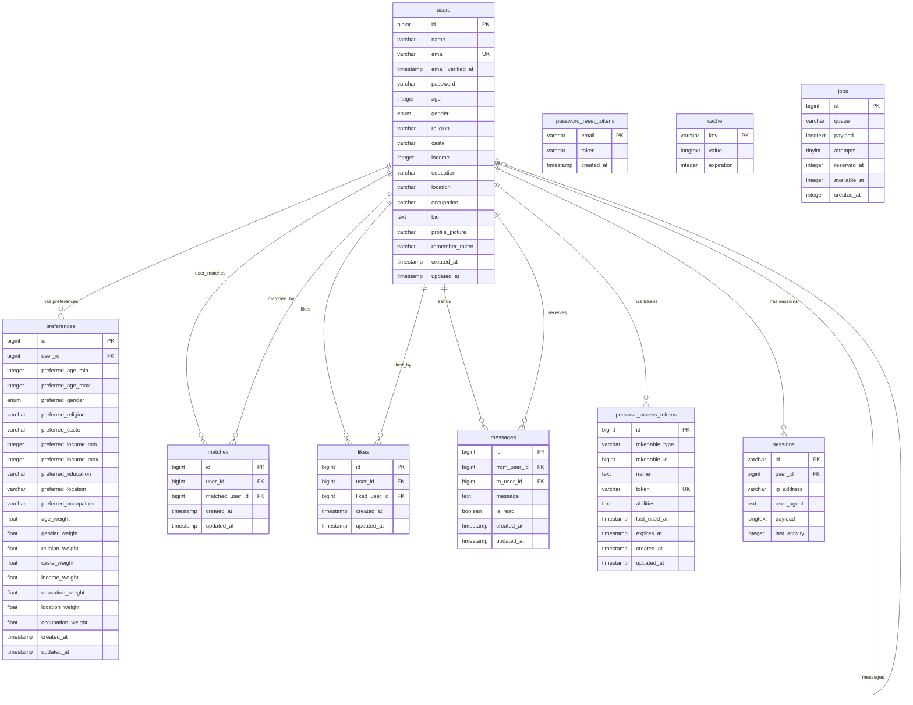

# Matrimonial API ER Diagram (Mermaid Version)

## Complete Entity Relationship Diagram

## Key Features of the ER Diagram

### 1. **Core Business Entities**

-   **Users**: Comprehensive user profiles with demographic, professional, and personal information
-   **Preferences**: User-defined matching criteria with weighted scoring system
-   **Matches**: Mutual connections between users
-   **Likes**: One-way user interests
-   **Messages**: Communication system between matched users

### 2. **Authentication & Security**

-   **Personal Access Tokens**: API authentication with polymorphic relationships
-   **Password Reset Tokens**: Secure password recovery system
-   **Sessions**: User session management

### 3. **System Tables**

-   **Cache**: Application-level caching for performance
-   **Jobs**: Background job processing with queue management

### 4. **Data Integrity Features**

-   **Primary Keys**: Auto-incrementing IDs for most tables
-   **Foreign Keys**: Cascade delete for referential integrity
-   **Unique Constraints**: Prevents duplicate data
-   **Indexes**: Optimized for query performance

### 5. **Relationship Types**

-   **One-to-One**: User ↔ Preferences
-   **One-to-Many**: User ↔ Tokens, User ↔ Sessions
-   **Many-to-Many**: User ↔ User (through matches, likes, messages)
-   **Self-Referential**: Users can connect with other users

## Database Schema Summary

| Table                    | Purpose                  | Key Relationships                              |
| ------------------------ | ------------------------ | ---------------------------------------------- |
| `users`                  | User profiles            | Primary entity, referenced by all other tables |
| `preferences`            | Matching criteria        | One-to-one with users                          |
| `matches`                | Mutual connections       | Many-to-many between users                     |
| `likes`                  | User interests           | Many-to-many between users                     |
| `messages`               | Communication            | Many-to-many between users                     |
| `personal_access_tokens` | API authentication       | Polymorphic relationship                       |
| `password_reset_tokens`  | Password recovery        | Email-based                                    |
| `sessions`               | Session management       | One-to-many with users                         |
| `cache`                  | Performance optimization | Standalone                                     |
| `jobs`                   | Background processing    | Standalone                                     |

## Constraints and Indexes

### Unique Constraints

-   `users.email` - Unique email addresses
-   `matches(user_id, matched_user_id)` - No duplicate matches
-   `likes(user_id, liked_user_id)` - No duplicate likes
-   `personal_access_tokens.token` - Unique API tokens

### Foreign Key Constraints

-   All foreign keys have `ON DELETE CASCADE`
-   Ensures data integrity when users are deleted

### Performance Indexes

-   Messages: `(from_user_id, to_user_id)` and `(to_user_id, from_user_id)`
-   Sessions: `user_id` and `last_activity`
-   Jobs: `queue` and `reserved_at`

This ER diagram represents the complete database structure of the Matrimonial API project, suitable for academic documentation and technical analysis.
