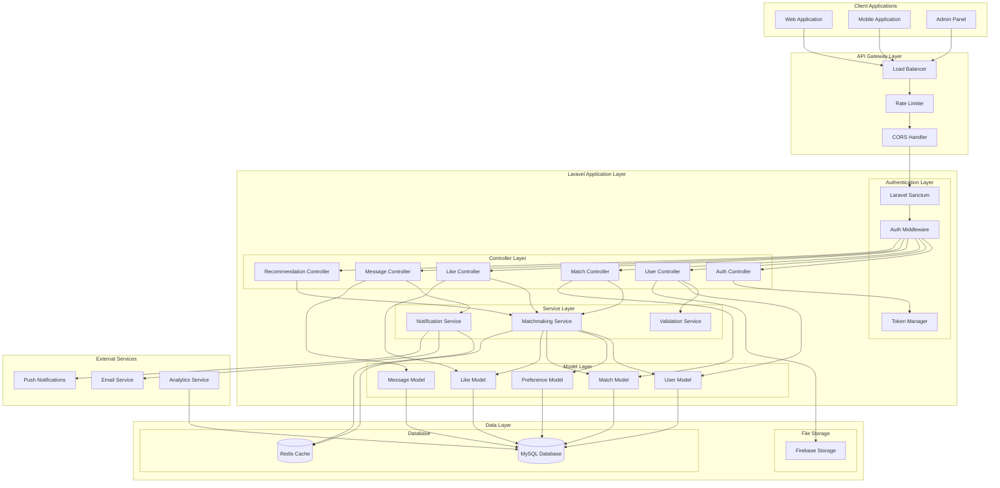
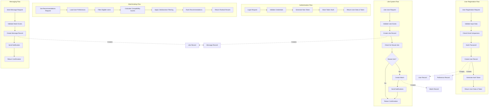
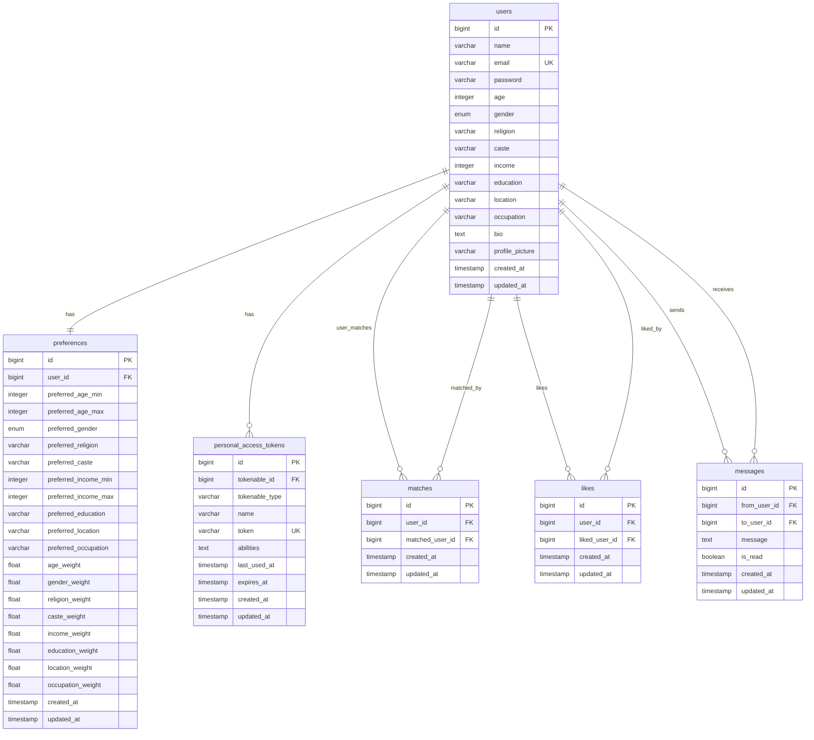
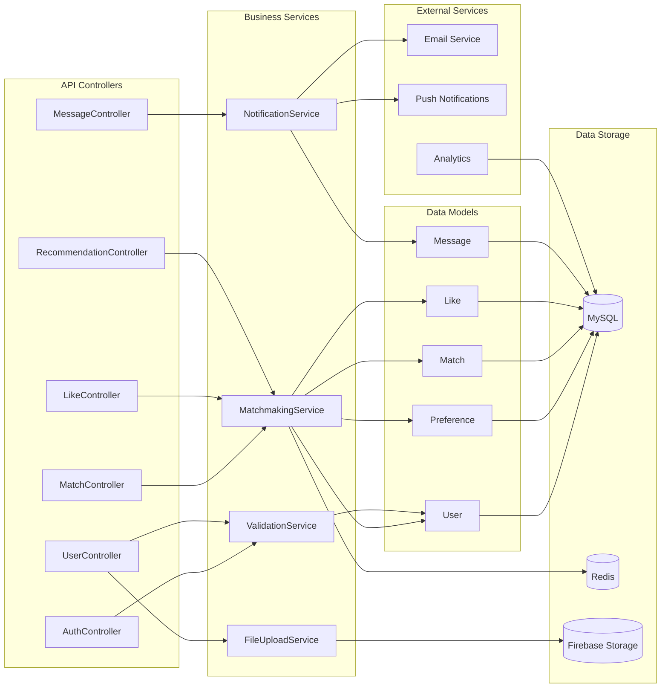
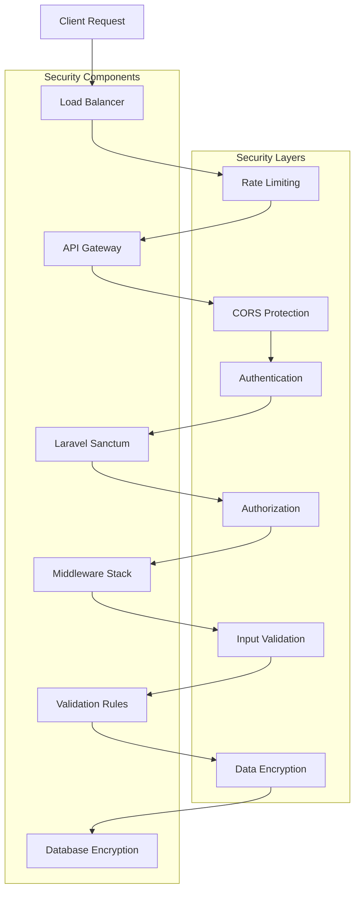
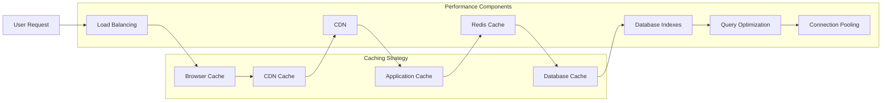
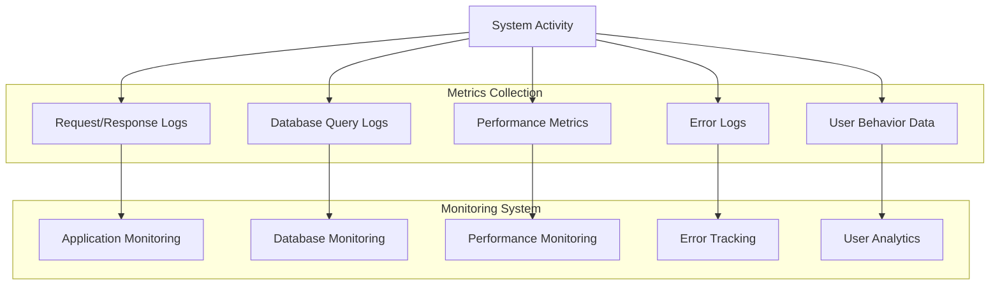

# Matrimonial API - Schema Diagram

## 🏗️ System Architecture Overview

The Matrimonial API follows a layered architecture pattern with clear separation of concerns, RESTful API design, and scalable database structure.

## 📊 Complete System Schema Diagram



## 🔄 Data Flow Schema



## 🗄️ Database Schema Architecture



## 🔧 Component Architecture



## 📡 API Endpoint Schema

```mermaid
graph TD
    %% Authentication Endpoints
    subgraph "Authentication Endpoints"
        AE1[POST /api/register]
        AE2[POST /api/login]
        AE3[POST /api/logout]
        AE4[GET /api/user]
    end

    %% User Profile Endpoints
    subgraph "User Profile Endpoints"
        PE1[GET /api/profile]
        PE2[PUT /api/profile]
        PE3[POST /api/profile/preferences]
    end

    %% Matchmaking Endpoints
    subgraph "Matchmaking Endpoints"
        ME1[GET /api/recommendations]
        ME2[POST /api/matches/{user_id}]
        ME3[GET /api/matches]
        ME4[DELETE /api/matches/{user_id}]
    end

    %% Like System Endpoints
    subgraph "Like System Endpoints"
        LE1[POST /api/likes/{user_id}]
        LE2[DELETE /api/likes/{user_id}]
        LE3[GET /api/likes]
    end

    %% Messaging Endpoints
    subgraph "Messaging Endpoints"
        MGE1[POST /api/messages/send]
        MGE2[GET /api/messages/{user_id}]
        MGE3[GET /api/messages]
    end

    %% Controller Connections
    AE1 --> AC1
    AE2 --> AC1
    AE3 --> AC1
    AE4 --> AC1

    PE1 --> AC2
    PE2 --> AC2
    PE3 --> AC2

    ME1 --> AC6
    ME2 --> AC3
    ME3 --> AC3
    ME4 --> AC3

    LE1 --> AC4
    LE2 --> AC4
    LE3 --> AC4

    MGE1 --> AC5
    MGE2 --> AC5
    MGE3 --> AC5
```

## 🔐 Security Schema



## 🚀 Performance Schema



## 📊 Monitoring Schema



## 🎯 Schema Benefits

### Architecture Benefits

1. **Scalability**: Horizontal scaling with load balancers
2. **Maintainability**: Clear separation of concerns
3. **Security**: Multiple security layers
4. **Performance**: Caching at multiple levels
5. **Reliability**: Fault-tolerant design

### Data Flow Benefits

1. **Efficiency**: Optimized data flow paths
2. **Consistency**: ACID compliance in database
3. **Performance**: Indexed queries and caching
4. **Security**: Data validation at each layer

### Component Benefits

1. **Modularity**: Independent service components
2. **Reusability**: Shared services across controllers
3. **Testability**: Isolated components for testing
4. **Flexibility**: Easy to extend and modify

---

**This schema diagram provides a comprehensive view of the matrimonial API system architecture, data flow, and component relationships. It serves as a technical blueprint for understanding the system design and implementation.**
