# Matrimonial API - Sequence Diagrams

## 🎯 Sequence Diagram Overview

This document contains comprehensive sequence diagrams showing the key interactions and data flows in the Matrimonial API system. Each diagram illustrates the communication between different system components and actors.

## 📊 User Registration Sequence

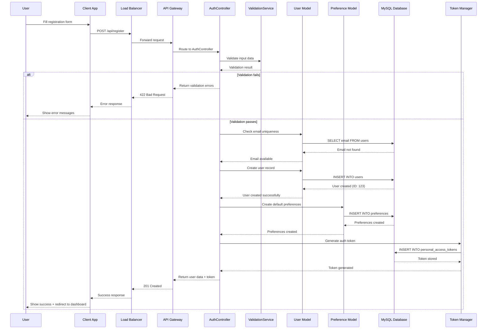

## 🔐 User Login Sequence

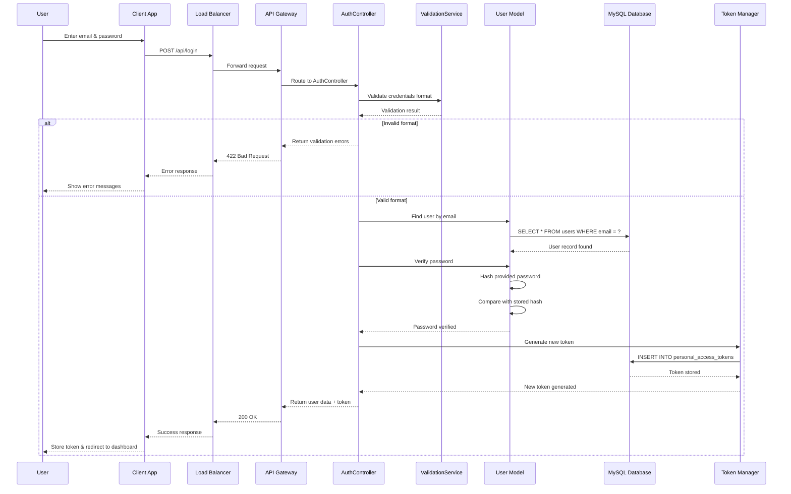

## 👤 Profile Management Sequence

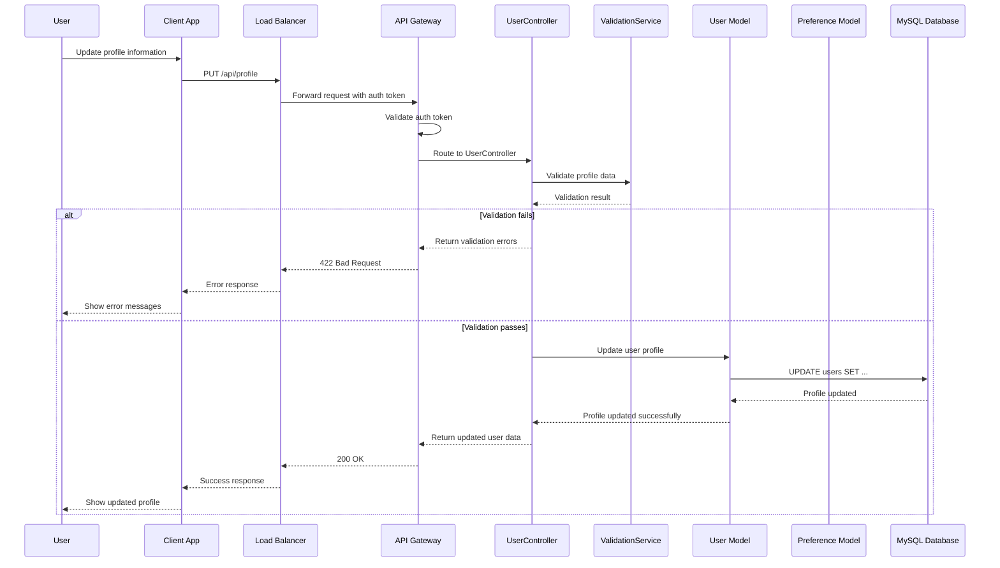

## 🎯 Preference Management Sequence

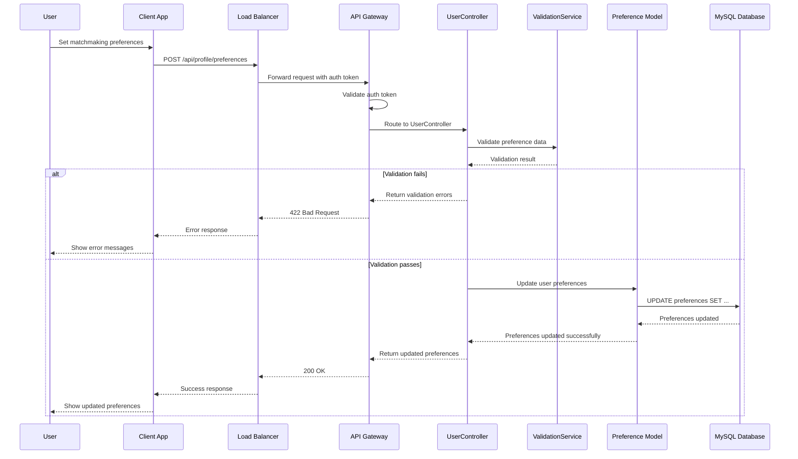

## 🔍 Matchmaking Recommendations Sequence

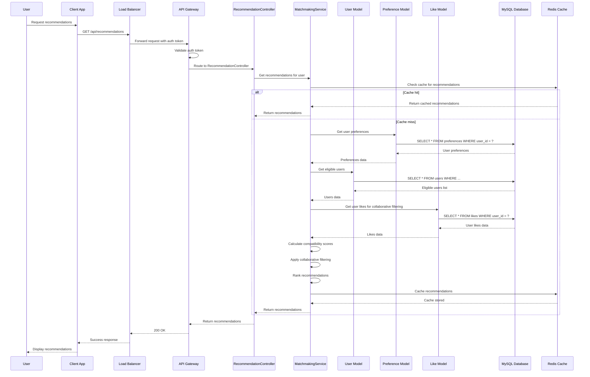

## ❤️ Like User Sequence

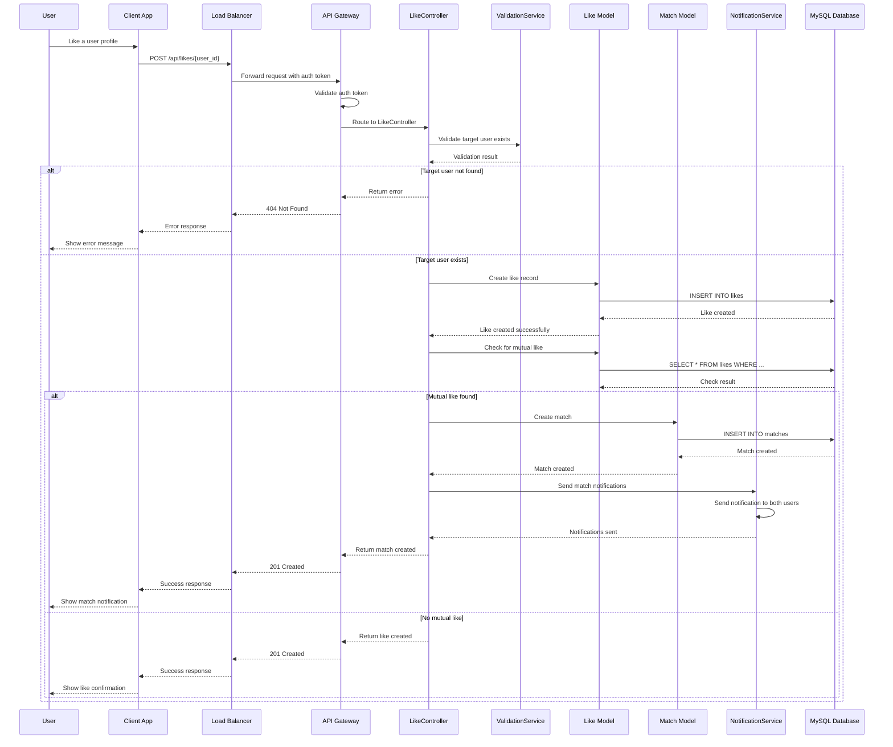

## 💬 Messaging Sequence

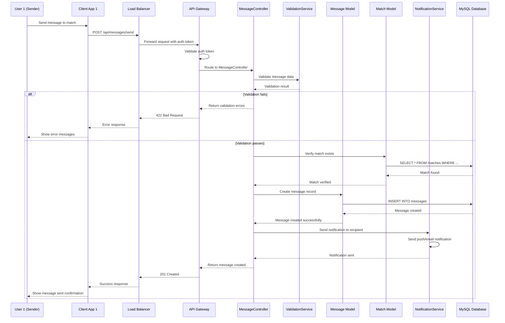

## 💬 View Conversation Sequence

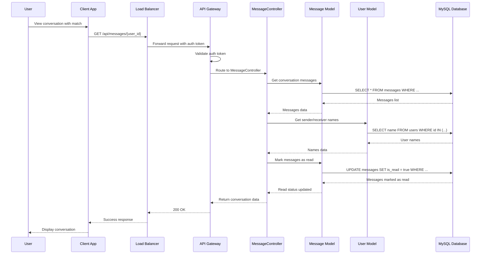

## 🔍 View Matches Sequence

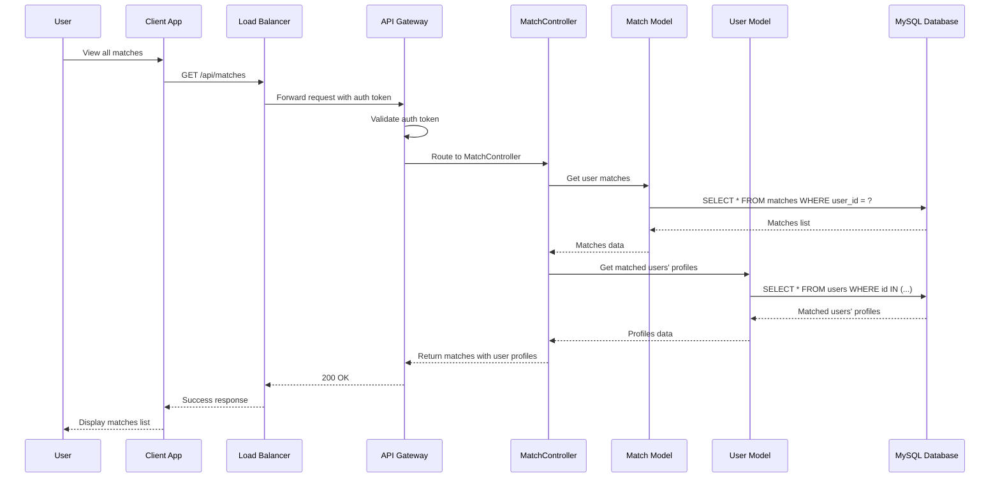

## 🚪 User Logout Sequence

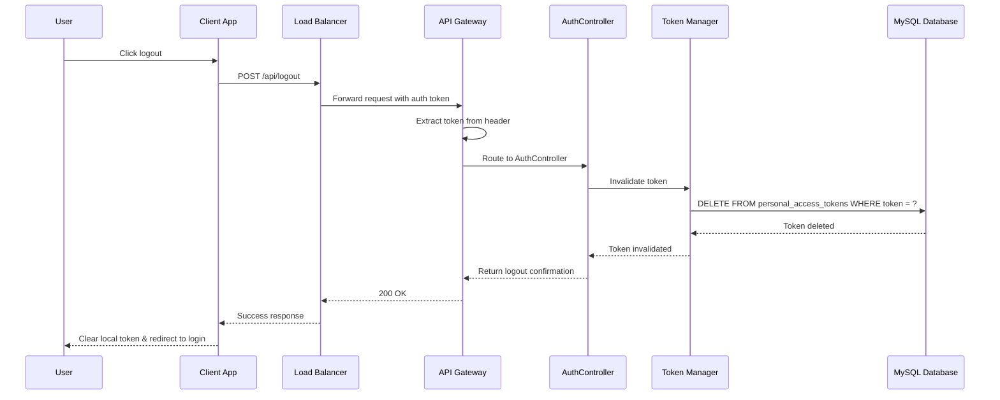

## 🔄 Real-time Notification Sequence

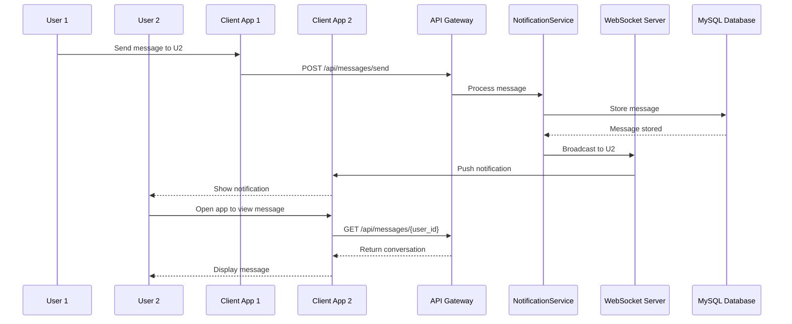

## 📊 Error Handling Sequence

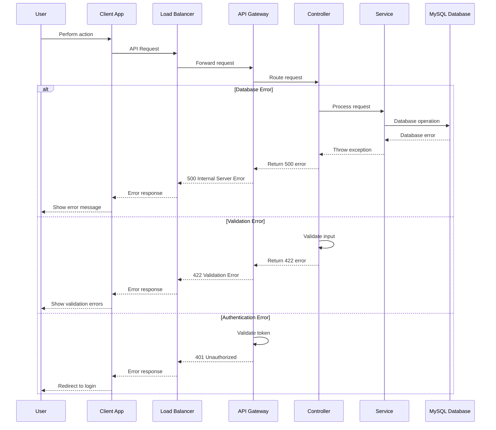

## 🎯 Sequence Diagram Benefits

### **For Developers:**

1. **Clear Understanding**: Visual representation of system interactions
2. **Debugging**: Easy to trace data flow and identify issues
3. **Implementation**: Step-by-step guide for coding
4. **Testing**: Basis for integration test scenarios

### **For System Design:**

1. **Architecture Validation**: Verify component interactions
2. **Performance Analysis**: Identify bottlenecks in data flow
3. **Security Review**: Understand authentication and authorization flows
4. **Scalability Planning**: Identify areas for optimization

### **For Documentation:**

1. **Technical Reference**: Complete system behavior documentation
2. **Onboarding**: New developers can understand system quickly
3. **Stakeholder Communication**: Visual explanation of system processes
4. **Maintenance**: Reference for system modifications

## 🔧 Key Components in Sequences

### **Frontend Components:**

-   **Client App**: Mobile/Web application
-   **Load Balancer**: Request distribution
-   **API Gateway**: Request routing and authentication

### **Backend Components:**

-   **Controllers**: Request handling and response generation
-   **Services**: Business logic implementation
-   **Models**: Data access and manipulation
-   **Validation**: Input validation and sanitization

### **Data Storage:**

-   **MySQL Database**: Primary data storage
-   **Redis Cache**: Performance optimization
-   **File Storage**: Profile pictures and media

### **External Services:**

-   **Notification Service**: Push notifications and emails
-   **WebSocket Server**: Real-time communication
-   **Analytics Service**: User behavior tracking

---

**These sequence diagrams provide a comprehensive view of all major system interactions in the matrimonial API. They serve as a technical reference for understanding data flow, system behavior, and component communication.**
