# Matrimonial API - Use Case Diagram

## 🎯 Use Case Overview

The Matrimonial API system provides a comprehensive platform for user registration, profile management, matchmaking, and communication. This use case diagram illustrates all the interactions between users and the system.

## 📊 Complete Use Case Diagram

```mermaid
graph TB
    %% Actors
    User((User))
    Admin((Admin))
    System((System))
    
    %% Use Case Packages
    subgraph "Authentication & Profile Management"
        UC1[Register Account]
        UC2[Login to System]
        UC3[Logout from System]
        UC4[View Own Profile]
        UC5[Update Profile Information]
        UC6[Upload Profile Picture]
        UC7[Delete Account]
    end
    
    subgraph "Preference Management"
        UC8[Set Matchmaking Preferences]
        UC9[Update Preference Weights]
        UC10[View Current Preferences]
        UC11[Reset Preferences to Default]
    end
    
    subgraph "Matchmaking & Discovery"
        UC12[Browse User Recommendations]
        UC13[View User Profiles]
        UC14[Get Matchmaking Suggestions]
        UC15[Filter Recommendations]
        UC16[Search Users by Criteria]
    end
    
    subgraph "Like & Match System"
        UC17[Like a User]
        UC18[Unlike a User]
        UC19[View Liked Users]
        UC20[View Users Who Liked Me]
        UC21[Create Mutual Match]
        UC22[View All Matches]
        UC23[Remove Match]
    end
    
    subgraph "Communication System"
        UC24[Send Message to Match]
        UC25[View Conversation History]
        UC26[Mark Message as Read]
        UC27[View All Conversations]
        UC28[Delete Message]
        UC29[Block User]
    end
    
    subgraph "System Management"
        UC30[Generate Authentication Token]
        UC31[Validate User Session]
        UC32[Process Matchmaking Algorithm]
        UC33[Send Notifications]
        UC34[Generate System Reports]
        UC35[Monitor System Performance]
    end
    
    %% User Relationships
    User --> UC1
    User --> UC2
    User --> UC3
    User --> UC4
    User --> UC5
    User --> UC6
    User --> UC7
    User --> UC8
    User --> UC9
    User --> UC10
    User --> UC11
    User --> UC12
    User --> UC13
    User --> UC14
    User --> UC15
    User --> UC16
    User --> UC17
    User --> UC18
    User --> UC19
    User --> UC20
    User --> UC21
    User --> UC22
    User --> UC23
    User --> UC24
    User --> UC25
    User --> UC26
    User --> UC27
    User --> UC28
    User --> UC29
    
    %% Admin Relationships
    Admin --> UC34
    Admin --> UC35
    
    %% System Relationships
    System --> UC30
    System --> UC31
    System --> UC32
    System --> UC33
    
    %% Include Relationships
    UC2 -.->|includes| UC30
    UC21 -.->|includes| UC32
    UC24 -.->|includes| UC31
    UC25 -.->|includes| UC31
    
    %% Extend Relationships
    UC17 -.->|extends| UC32
    UC18 -.->|extends| UC32
    UC21 -.->|extends| UC33
    UC24 -.->|extends| UC33
```

## 🔄 Detailed Use Case Descriptions

### Authentication & Profile Management

#### UC1: Register Account
- **Actor**: User
- **Description**: New user creates an account with basic information
- **Preconditions**: User is not registered
- **Main Flow**:
  1. User provides name, email, password, and basic profile info
  2. System validates email uniqueness
  3. System hashes password
  4. System creates user account
  5. System generates authentication token
  6. System returns user data and token
- **Postconditions**: User account created, user logged in

#### UC2: Login to System
- **Actor**: User
- **Description**: Registered user logs into the system
- **Preconditions**: User has valid account
- **Main Flow**:
  1. User provides email and password
  2. System validates credentials
  3. System generates new authentication token
  4. System returns user data and token
- **Postconditions**: User authenticated, session active

#### UC3: Logout from System
- **Actor**: User
- **Description**: User logs out and invalidates session
- **Preconditions**: User is logged in
- **Main Flow**:
  1. User requests logout
  2. System invalidates authentication token
  3. System confirms logout
- **Postconditions**: User session terminated

#### UC4: View Own Profile
- **Actor**: User
- **Description**: User views their complete profile information
- **Preconditions**: User is authenticated
- **Main Flow**:
  1. User requests profile data
  2. System retrieves user profile and preferences
  3. System returns complete profile information
- **Postconditions**: User sees their profile

#### UC5: Update Profile Information
- **Actor**: User
- **Description**: User updates their profile information
- **Preconditions**: User is authenticated
- **Main Flow**:
  1. User provides updated profile data
  2. System validates input data
  3. System updates user profile
  4. System returns updated profile
- **Postconditions**: Profile information updated

### Preference Management

#### UC8: Set Matchmaking Preferences
- **Actor**: User
- **Description**: User sets their matchmaking preferences
- **Preconditions**: User is authenticated
- **Main Flow**:
  1. User provides preference criteria (age, gender, religion, etc.)
  2. User sets importance weights for each preference
  3. System validates preference data
  4. System saves user preferences
  5. System returns confirmation
- **Postconditions**: User preferences saved

#### UC9: Update Preference Weights
- **Actor**: User
- **Description**: User modifies importance weights of preferences
- **Preconditions**: User has existing preferences
- **Main Flow**:
  1. User provides new weight values
  2. System validates weight ranges (0-10)
  3. System updates preference weights
  4. System returns updated preferences
- **Postconditions**: Preference weights updated

### Matchmaking & Discovery

#### UC12: Browse User Recommendations
- **Actor**: User
- **Description**: User views personalized matchmaking recommendations
- **Preconditions**: User is authenticated and has preferences
- **Main Flow**:
  1. User requests recommendations
  2. System runs matchmaking algorithm
  3. System filters results based on user preferences
  4. System returns ranked recommendations
- **Postconditions**: User sees personalized recommendations

#### UC13: View User Profiles
- **Actor**: User
- **Description**: User views detailed profile of another user
- **Preconditions**: User is authenticated
- **Main Flow**:
  1. User selects a profile to view
  2. System retrieves user profile data
  3. System calculates compatibility score
  4. System returns profile with compatibility details
- **Postconditions**: User sees detailed profile

#### UC14: Get Matchmaking Suggestions
- **Actor**: User
- **Description**: System provides intelligent matchmaking suggestions
- **Preconditions**: User is authenticated
- **Main Flow**:
  1. System analyzes user behavior and preferences
  2. System applies collaborative filtering algorithm
  3. System generates personalized suggestions
  4. System returns ranked suggestions
- **Postconditions**: User receives intelligent suggestions

### Like & Match System

#### UC17: Like a User
- **Actor**: User
- **Description**: User expresses interest in another user
- **Preconditions**: User is authenticated, target user exists
- **Main Flow**:
  1. User selects a profile to like
  2. System creates like record
  3. System checks for mutual like
  4. If mutual, system creates match
  5. System returns confirmation
- **Postconditions**: Like recorded, potential match created

#### UC21: Create Mutual Match
- **Actor**: System
- **Description**: System creates match when both users like each other
- **Preconditions**: Both users have liked each other
- **Main Flow**:
  1. System detects mutual like
  2. System creates match record
  3. System enables messaging between users
  4. System sends notifications to both users
- **Postconditions**: Match created, messaging enabled

#### UC22: View All Matches
- **Actor**: User
- **Description**: User views all their mutual matches
- **Preconditions**: User is authenticated
- **Main Flow**:
  1. User requests matches
  2. System retrieves all user matches
  3. System includes match details and user profiles
  4. System returns match list
- **Postconditions**: User sees all matches

### Communication System

#### UC24: Send Message to Match
- **Actor**: User
- **Description**: User sends message to a matched user
- **Preconditions**: User is authenticated, match exists
- **Main Flow**:
  1. User selects match and composes message
  2. System validates match relationship
  3. System saves message
  4. System sends notification to recipient
  5. System returns confirmation
- **Postconditions**: Message sent, notification delivered

#### UC25: View Conversation History
- **Actor**: User
- **Description**: User views complete conversation with a match
- **Preconditions**: User is authenticated, match exists
- **Main Flow**:
  1. User selects a match
  2. System retrieves all messages in conversation
  3. System marks messages as read
  4. System returns conversation history
- **Postconditions**: User sees conversation, messages marked read

#### UC27: View All Conversations
- **Actor**: User
- **Description**: User views list of all conversations
- **Preconditions**: User is authenticated
- **Main Flow**:
  1. User requests conversations list
  2. System retrieves all user conversations
  3. System includes last message and unread count
  4. System returns conversations list
- **Postconditions**: User sees all conversations

### System Management

#### UC30: Generate Authentication Token
- **Actor**: System
- **Description**: System generates secure authentication token
- **Preconditions**: User credentials are valid
- **Main Flow**:
  1. System creates unique token
  2. System hashes token for storage
  3. System associates token with user
  4. System returns token to user
- **Postconditions**: Token generated and stored

#### UC32: Process Matchmaking Algorithm
- **Actor**: System
- **Description**: System runs collaborative filtering algorithm
- **Preconditions**: User has preferences set
- **Main Flow**:
  1. System loads user preferences
  2. System analyzes user behavior (likes)
  3. System calculates compatibility scores
  4. System applies collaborative filtering
  5. System returns ranked recommendations
- **Postconditions**: Recommendations generated

#### UC33: Send Notifications
- **Actor**: System
- **Description**: System sends notifications for various events
- **Preconditions**: Event has occurred
- **Main Flow**:
  1. System detects event (match, message, etc.)
  2. System determines notification type
  3. System generates notification content
  4. System delivers notification to user
- **Postconditions**: Notification sent

## 🔗 Use Case Relationships

### Include Relationships
- **UC2 (Login)** includes **UC30 (Generate Token)**
- **UC21 (Create Match)** includes **UC32 (Process Algorithm)**
- **UC24 (Send Message)** includes **UC31 (Validate Session)**
- **UC25 (View Conversation)** includes **UC31 (Validate Session)**

### Extend Relationships
- **UC17 (Like User)** extends **UC32 (Process Algorithm)**
- **UC18 (Unlike User)** extends **UC32 (Process Algorithm)**
- **UC21 (Create Match)** extends **UC33 (Send Notifications)**
- **UC24 (Send Message)** extends **UC33 (Send Notifications)**

## 🎯 Business Rules

### Authentication Rules
1. **Email Uniqueness**: Each email can only be registered once
2. **Password Security**: Passwords must be hashed before storage
3. **Token Expiration**: Authentication tokens can expire
4. **Session Validation**: All protected operations require valid session

### Matchmaking Rules
1. **Mutual Matching**: Matches only created when both users like each other
2. **Preference Requirements**: Users must set preferences for recommendations
3. **Algorithm Processing**: Recommendations use collaborative filtering
4. **Weight System**: Each preference has configurable importance

### Communication Rules
1. **Match-Only Messaging**: Messages only allowed between matched users
2. **Read Status Tracking**: Messages track read/unread status
3. **Conversation History**: Complete message history maintained
4. **Notification Delivery**: Users notified of new messages/matches

### System Rules
1. **Data Validation**: All input data validated before processing
2. **Error Handling**: System handles errors gracefully
3. **Performance Optimization**: Efficient algorithms and caching
4. **Security**: All sensitive data encrypted and protected

## 📊 Use Case Metrics

### User Engagement Metrics
- **Registration Rate**: New user signups per day
- **Login Frequency**: Average logins per user per week
- **Profile Completion**: Percentage of users with complete profiles
- **Preference Setting**: Percentage of users who set preferences

### Matchmaking Metrics
- **Recommendation Views**: Number of recommendation requests
- **Like Rate**: Percentage of recommendations that receive likes
- **Match Success Rate**: Percentage of likes that result in matches
- **Algorithm Performance**: Recommendation accuracy scores

### Communication Metrics
- **Message Volume**: Number of messages sent per day
- **Response Rate**: Percentage of messages that receive responses
- **Conversation Length**: Average messages per conversation
- **User Activity**: Active users per day/week

---

**This use case diagram provides a comprehensive view of all user interactions and system functionalities in the matrimonial API. It serves as a guide for understanding user requirements and system behavior.**
